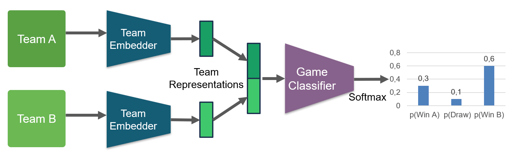

# Predicting National Team Football Match Outcomes

[](https://github.com/larsteu/dlam)

This repository contains the code for our Deep Learning: Architectures \& Methods project (course by TU Darmstadt). This project aims to predict the outcomes of national team football matches using a novel deep learning approach.
Our final evaluation is on the European Championship 2024 matches.

## Motivation
- Existing work on football match prediction focuses on statistical models [1-5] and league games [1,2].
- **Gap:** Deep learning-based prediction for national team games
- Challenges:
  - Sparse data for national team matches
  - Players from different leagues with varying competitive levels
- Proposed solutions:
  1. Input: Per-player average match statistics from the past year in their national leagues
  2. League-dependent weighting of player statistics
  3. Two-step training process to leverage more data:
     - Step 1: Train on league data
     - Step 2: Fine-tune on national matches

## Model Architecture

Our model consists of two main components:

1. Team Embedder: Processes average player performance to create team embeddings
2. Match Classifier: Takes two team embeddings as input and predicts the match result

### Training Step 1: League Data



### Training Step 2: National Team Data


## Data
We retrieved all our data used for training and validation from the [API-sports](https://api-sports.io/) platform.  
The relevant player statistics are:  
- player_position
- minutes_played
- attempted_shots
- shots_on_goal
- goals
- assists
- total_passes
- key_passes
- pass_completion
- saves
- tackles
- blocks
- interceptions
- conceded_goals
- total_duels
- won_duels
- attempted_dribbles
- successful_dribbles
- cards

For Training Step 1, we used matches from the following leagues:
- Premier League
- La Liga
- Serie A
- Bundesliga
- Ligue 1

For Training Step 2, we used matches from the following national tournaments:
- UEFA Nations League
- World Cup 2018, 2022
- Euro 2020

### Generate our learning data
To request the data from the API and preprocess it to work with our model, we used the python scripts in the 'data' folder
REQUIRED: You need to have an API key from [API-sports](https://api-sports.io/) to use the scripts and use the API internal IDs for the leagues / tournaments

- `get_training_data_with_avg.py` creates a csv with the all matches from a given league (or tournament) in a given timeframe and the average player statistics of the last year for each team
- `api_request.py` creates a csv with the all matches from a given league (or tournament) in a given timeframe and the player statistics for each player (*not average!*)
- `get_prediction_data.py` creates folders for each participating team in a tournament filled with the average player statistics of the last year for each player

#### Example Generation for Training Step 1
Either use average data for training:
```bash
python get_training_data_with_avg.py <api_key> <league_id> <start_season> <end_season> <output_file>
```
Or (non-average) match data:
```bash
python api_request.py <api_key> <league_id> <start_season-end_season> <output_file>
```

#### Example Generation for Training Step 2
*currently still needs the match data and the average player statistics of a given year separately, support for using data from `get_training_data_with_avg.py` tbd*  
  
First get all the matches of a tournament using `api_request.py`
```bash
python api_request.py <api_key> <tournament_id> <start_season-end_season> <output_file>
```
Then get the average player statistics for each team and each season in the tournament
```bash
python get_prediction_data.py <api_key> <tournament_id> <season> <output_folder>
```
## Results

- Evaluated on Euro 2024 (51 matches)
- Achieved approximately 59% accuracy
- Slightly outperformed betting odds
- **But:** Needs more evaluation: Euro 2024 only has 51 games.


## Authors
- Paul Andre Seitz
- Leon Arne Engländer
- Lars Damian Teubner
- Daniel Kirn

## References

[1] Moustakidis et al. "Predicting Football Team Performance with Explainable AI: Leveraging SHAP to Identify Key Team-Level Performance Metrics". Future Internet, 2023.  
[2] Choi et al. "Predicting Football Match Outcomes with Machine Learning Approaches". MENDEL, 2023.  
[3] Pinasthika and Fudholi. "World Cup 2022 Knockout Stage Prediction Using Poisson Distribution Model". IJCCS, 2023.  
[4] Schauberger and Groll. "Predicting matches in international football tournaments with random forests". Statistical Modelling, 2018.  
[5] Groll et al. "Prediction of major international soccer tournaments based on team-specific regularized Poisson regression: An application to the FIFA World Cup 2014". Journal of Quantitative Analysis in Sports, 2015.